# 📱 FitScale – BMI Calculator & Wellness Guide

FitScale is a beautifully designed Flutter app that calculates your Body Mass Index (BMI) and provides **personalized health suggestions**, **exercise tips**, and **diet plans** based on your BMI category. It aims to **motivate users** to achieve a healthier lifestyle through a clean interface and smart features.

---

## 🔗 Live Demo

> 🚀 **Try it now (APK):** [Download APK](http://127.0.0.1:5500/106_Bootstrap_project/02_Bootstrap_with_CSS_webPage/img/FitScale.apk)  
> 🛠️ **GitHub Repository:** [github.com/yashgupta7373/FitScale](https://github.com/yashgupta7373/FitScale)

---

## 📸 Screenshots

| Splash Screen                | BMI Calculate                     | Result Screen                             |
|------------------------------|-----------------------------------|-------------------------------------------|
| 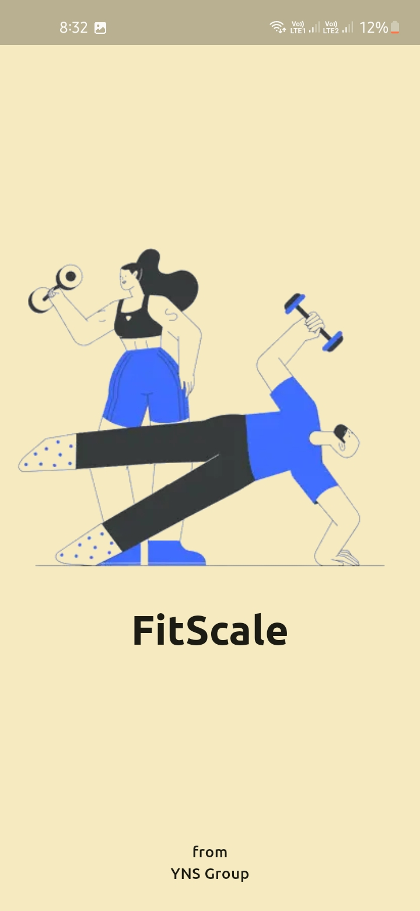 | 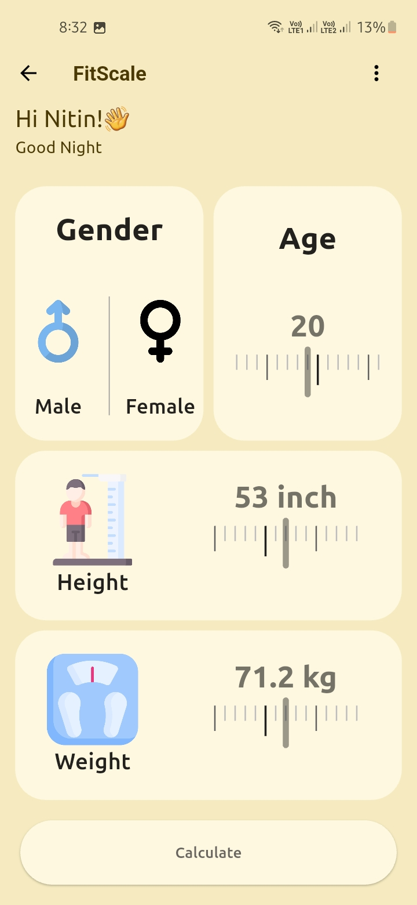   | 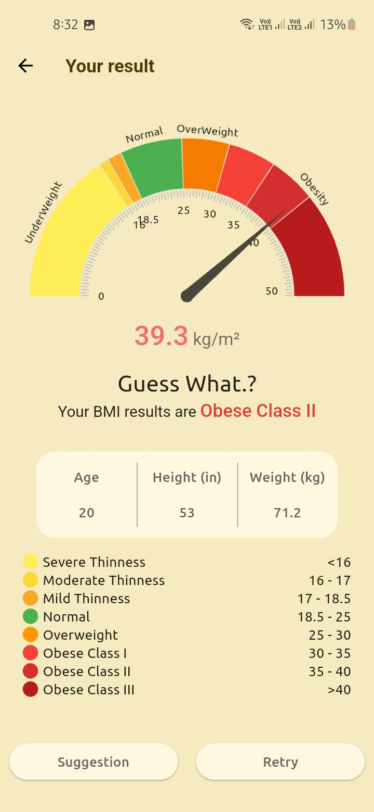         |
| 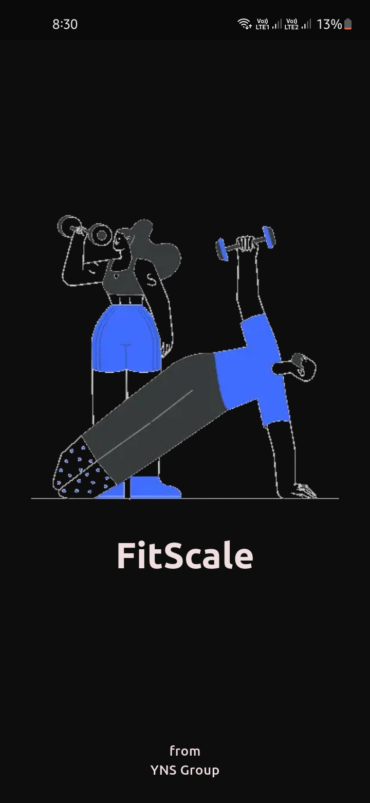 | 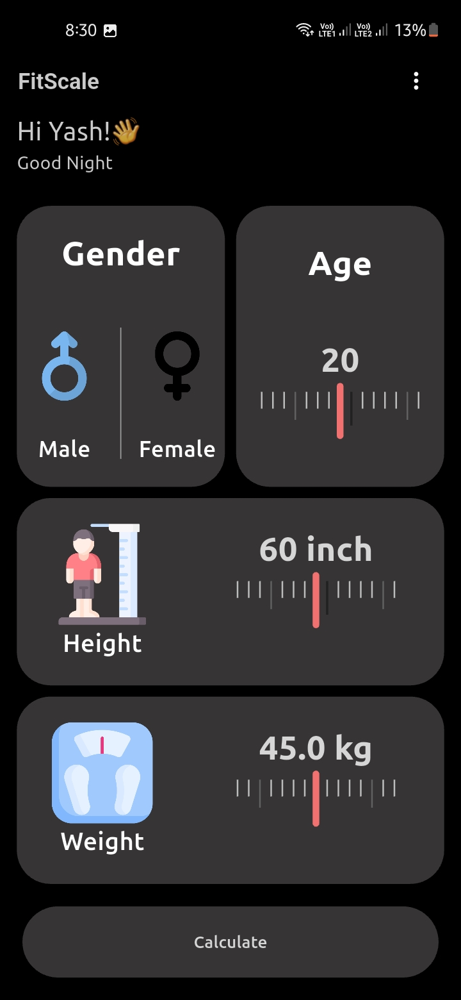   | 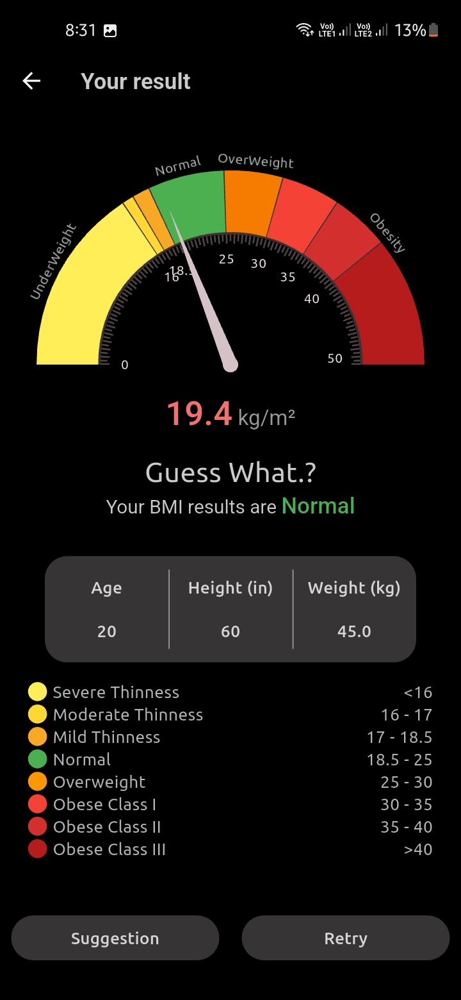         |
| Suggestion Screen            | Other Screen                      | Other Screen                              |
| 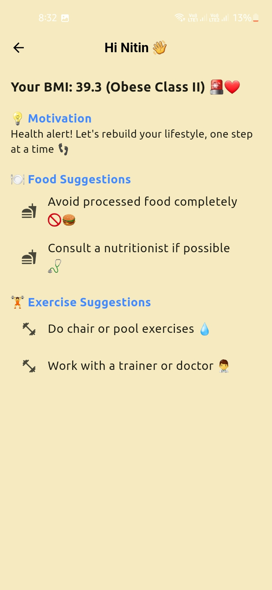 | 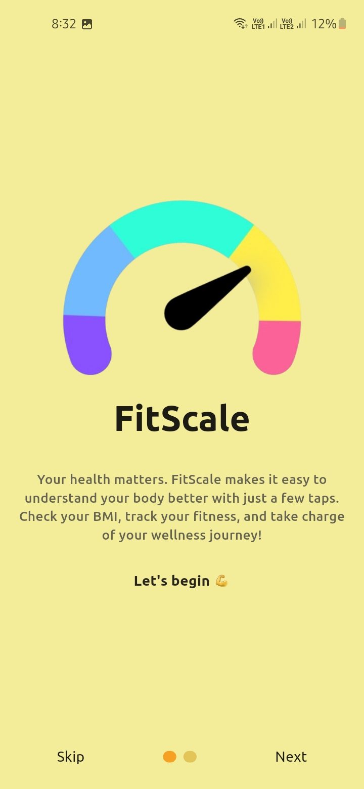      | 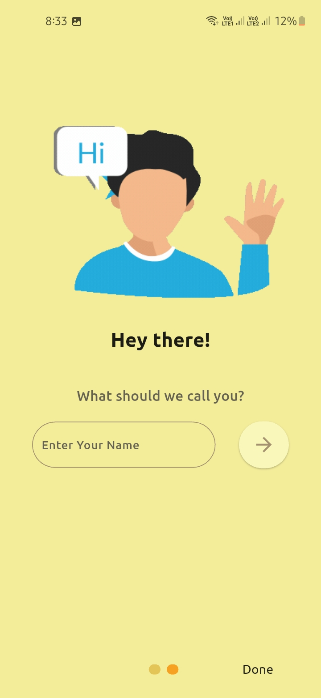              |
| 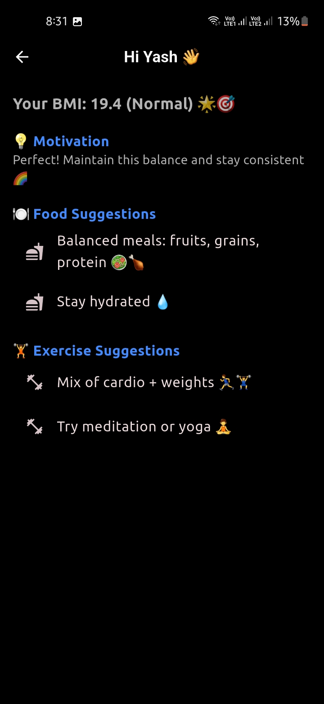 | 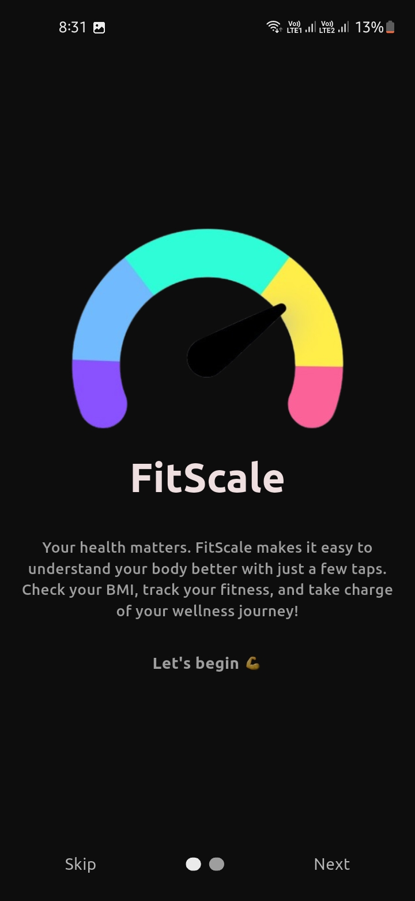      | 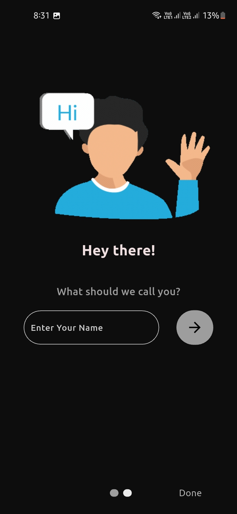              |

---

## ✨ Features

- 🎯 BMI Calculator based on age, height, weight, and gender
- 🔥 Personalized health category (Normal, Overweight, Obese, etc.)
- 💡 Smart Suggestion Page with motivation, food & exercise tips
- 🎨 Light/Dark mode support (Theme switcher)
- 🧑‍💼 Developer Page with links and intro
- 🧠 Easy-to-use UI built with Flutter's Material Design

---

## 🛠️ Tech Stack

- **Flutter** (UI Framework)
- **Dart** (Programming Language)
- **Shared Preferences** (Local storage)
- **Syncfusion Flutter Gauges** (Radial BMI gauge)
- **FontAwesome Icons** (Social & UI icons)

---

## 🚀 How to Run Locally

```bash
# 1. Clone the repository
git clone https://github.com/yashgupta7373/FitScale.git
cd FitScale

# 2. Get Flutter packages
flutter pub get

# 3. Run the app on emulator or real device
flutter run

✅ Make sure you have Flutter installed: https://docs.flutter.dev/get-started/install

```

### 🙌 Contributing

Pull requests are welcome! If you want to contribute:
1. Fork the project
2. Create your feature branch (git checkout -b feature/YourFeature)
3. Commit your changes (git commit -m 'Add feature')
4. Push to the branch (git push origin feature/YourFeature)
5. Open a Pull Request

---

### ❤️ Support

If you like this project, consider giving it a ⭐ on GitHub!

---

## 🧑‍💻 Developer Info
Yash Gupta
